# Traffic Flow Use Linux Bridge & OpenvSwitch
North-South: Traffic từ instance ra mạng bên ngoài.  
East-West: Traffic giữa các instance trong cùng mạng hoặc khác mạng.  
## Linux Bridge - Provider Network
### North-South
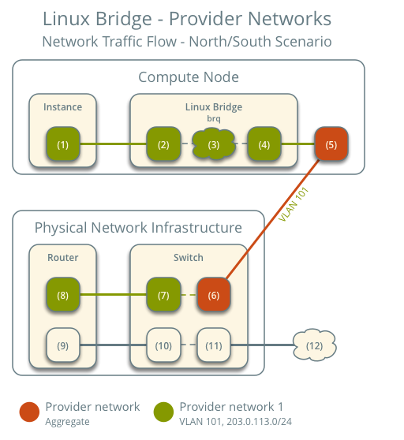   
- Instance forward packet to provider bridge thông qua veth pair (1)(2).  
- Tại (3), sẽ check các rule trong security group được áp cho instance, đồng thời tracking connection packet.  
- (4) VLAN sub interface forward packet ra card mạng vật lý trên compute node.  
- (5) Card mạng vật lý sẽ add tag VLAN vào packet và chuyển sang switch vật lý (6).  
- Switch xóa tag VLAN và forward sang Router.(7)
- (8,9,10,11,12) Router định tuyến packet như bình thường.  

### East-West
#### Same Network
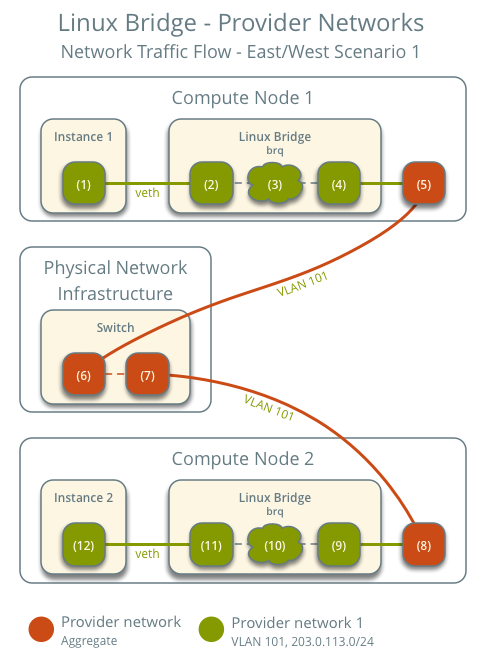  
- (1,2,3,4,5,6) tương tự như nort-south  
- Khi packet đến switch vật lý, do packet được gửi trong cùng 1 mạng, switch forward thẳng packet sang compute node 2 (7).  
- Card mạng vật lý remove tag vlan và forward sang subinterface vlan trên provider bridge (9).  
- (10) provider bridge check các rule trong security group và thực hiện tracking connection.  
- (11) provider bridge forward to instance 2 thông qua veth pair.  

#### Different Network
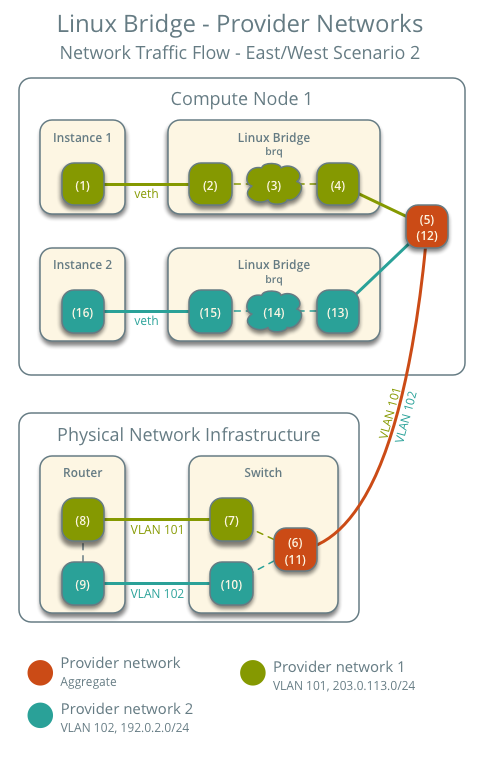  
- (1,2,3,4,5,6) tương tự như north-south
- Khi packet đến switch vật lý, remove vlan tag và do packet được gửi đến 1 instance khác network, switch forward lên router để định tuyến (7,8).  
- (9,10) Router định tuyến packet từ network 1 --> network 2.  
- (11) Switch add vlan tag và forward xuống compute node.  
- (12,13) Card mạng vật lý remove vlan tag và forward packet tới vlan sub interface trên provider bridge.  
- (14) provider bridge check các rule trong security group và thực hiện tracking connection.  
- (15) provider bridge forward to instance 2 thông qua veth pair.  

## Linux Bridge - Self Service
Trong ví dụ Self Service thì mạng self service sẽ dùng VXLAN, mạng provider dùng VLAN.  
### North-South
#### North-South Fixed IP
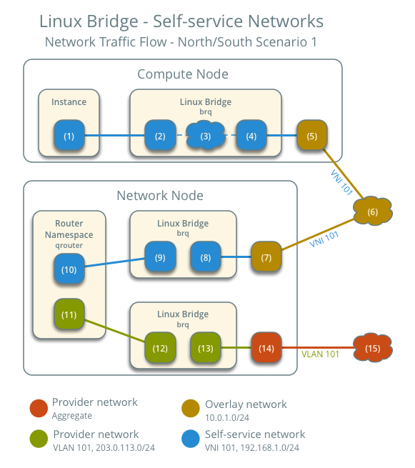  
- Instance forward packet tới self service bridge thông qua veth pair (1,2).  
- Tại (3), sẽ check các rule trong security group được áp cho instance, đồng thời tracking connection packet.
- Self service bridge forward packet tới VXLAN Interface (4) và đóng gói packet bằng VXLAN.  
- Card mạng vật lý cho VXLAN forward packet tới network node thông qua mạng overlay (5,6).  
- (7,8) Card mạng vật lý trên network node forward packet tới VXLAN Interface, sau đó loại bỏ tag VXLAN.  
- Self service bridge forward packet tới self service interface trong router namespace (9,10).  
- IPv4 Router thực hiện SNAT sang IP provider của router và chuyển nó tới IP Gateway của mạng provider (11).  
- Router forward packet sang provider bridge (12)  
- VLAN sub-interface trên provider bridge forward packet tới card mạng vật lý provider.  
- Card mạng vật lý add tag VLAN và forward packet ra Internet.  

#### North-South Floating IP
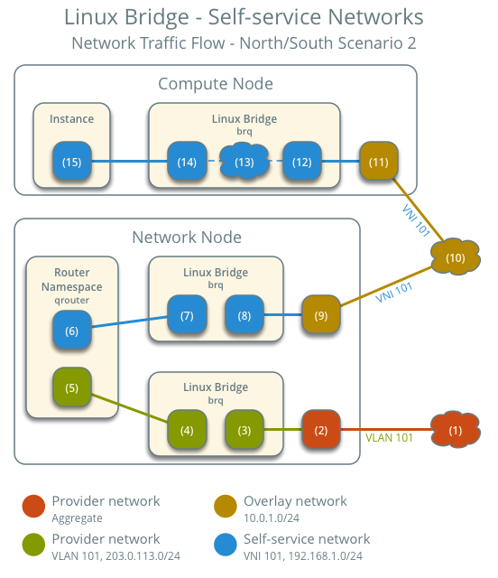  
- Quá trình khi packet từ Internet đến Floating IP ngược lại với quá trình đi ra Internet ở trên. Chỉ có khi Provider Bridge forward packet tới router, lúc này Router sẽ thực hiện DNAT từ floating IP --> địa chỉ IP của instance.  

### East-West
#### Same Network
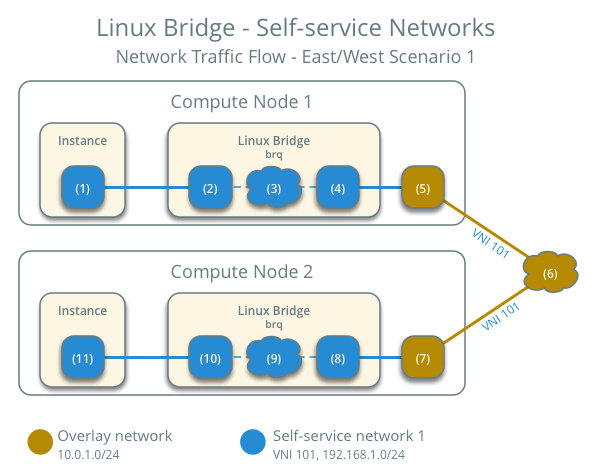  
- Cũng tương tự east-west same network Provider Network chỉ khác là thay vì forward ra vật lý thì nó sẽ gắn tag VXLAN vào forward thẳng sang compute node 2 luôn.  

#### Diff Network
- Cũng tương tự provider east-west different network chỉ khác là thay vì forward ra vật lý thì nó sẽ forward sang network node có router trên đó.  

## OpenvSwitch - Provider Network
### North-South
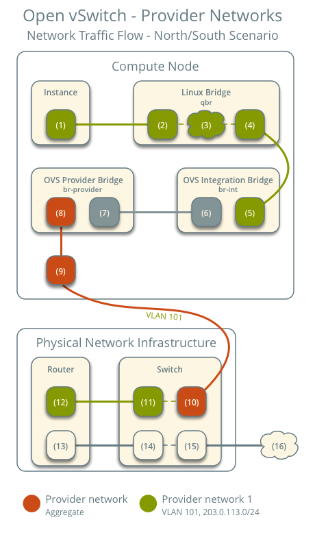  
- Instance forward packet to security group bridge thông qua veth pair (1)(2).  
- Tại (3), sẽ check các rule trong security group được áp cho instance, đồng thời tracking connection packet.  
- Tại security group bridge OVS Port forward packet tới OVS integration bridge security group port(5) thông qua veth pair.  
- OVS integration bridge add internal tag VLAN.  
- int-br-provider patch port (6) forward packet tới OVS provider bridge (phy-br-provider) patch port (7).  
- OVS provider bridge đổi internal tag VLAN thành VLAN thật.  
- OVS provider bridge network port forward packet tới card mạng vật lý (9).  
- Card mạng vật lý trên compute forward packet tới Switch vật lý (10).  
- Switch xóa tag VLAN và forward sang Router.(11,12)  
- (13,14,15,16) Router định tuyến packet như bình thường.  

### East-West
#### Same Network
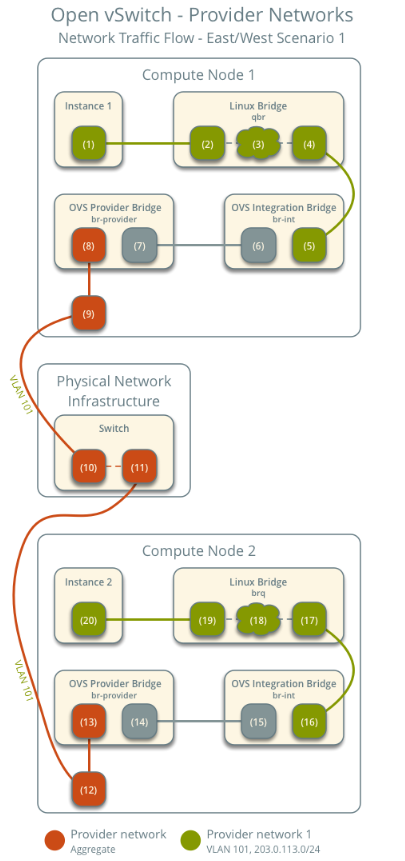  
- Instance forward packet to security group bridge thông qua veth pair (1)(2).  
- Tại (3), sẽ check các rule trong security group được áp cho instance, đồng thời tracking connection packet.  
- Tại security group bridge OVS Port forward packet tới OVS integration bridge security group port(5) thông qua veth pair.  
- OVS integration bridge add internal tag VLAN.  
- int-br-provider patch port (6) forward packet tới OVS provider bridge (phy-br-provider) patch port (7).  
- OVS provider bridge đổi internal tag VLAN thành VLAN thật.  
- OVS provider bridge network port forward packet tới card mạng vật lý (9).  
- Card mạng vật lý trên compute forward packet tới Switch vật lý (10).  
- Switch forward packet từ compute 1 sang compute 2 (11).  
- Card mạng vật lý trên compute 2 (12) forward packet tới OVS Provider Bridge provider network port (13).  
- OVS Provider bridge phy-br-provider patch port (14) forward packet tới OVS intgration bridge int-br-provider (15).  
- OVS int bridge swap tag vlan thật sang internal Vlan.  
- OVS int bridge security group port (16) forward packet tới security group bridge ovs port (17).  
- Tại (18), sẽ check các rule trong security group được áp cho instance, đồng thời tracking connection packet.  
- Security group bridge instance port (19) forward packet tới instance 2 interface (20) thông qua veth pair.  

#### Diff network
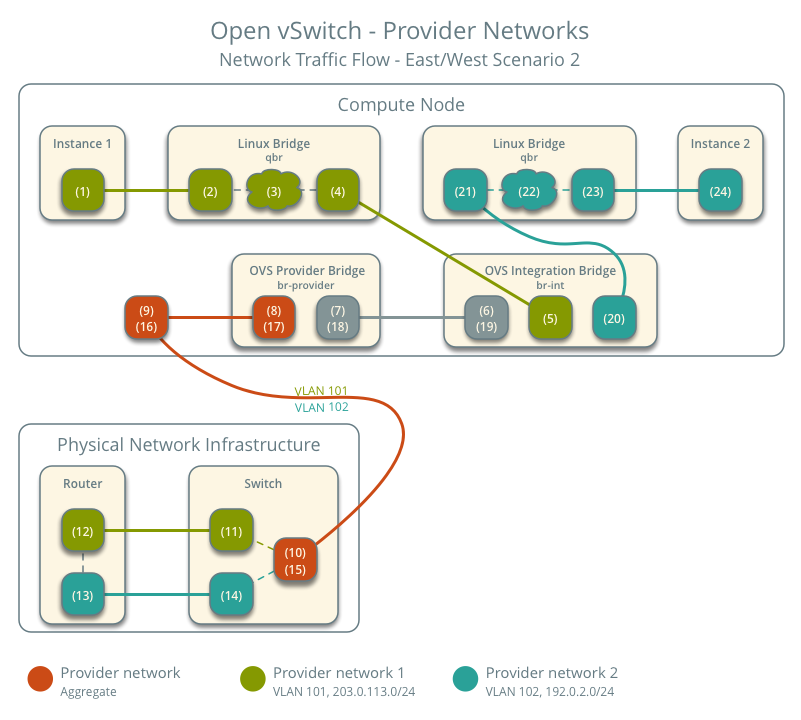  
- Instance forward packet to security group bridge thông qua veth pair (1)(2).  
- Tại (3), sẽ check các rule trong security group được áp cho instance, đồng thời tracking connection packet.  
- Tại security group bridge OVS Port forward packet tới OVS integration bridge security group port(5) thông qua veth pair.  
- OVS integration bridge add internal tag VLAN.  
- int-br-provider patch port (6) forward packet tới OVS provider bridge (phy-br-provider) patch port (7).  
- OVS provider bridge đổi internal tag VLAN thành VLAN thật.  
- OVS provider bridge network port forward packet tới card mạng vật lý (9).  
- Card mạng vật lý trên compute forward packet tới Switch vật lý (10).  
- Switch remove vlan tag và forward tới router (11).  
- router định tuyến từ provider network 1 sang provider network 2 (12,13).  
- router forward packet lại switch (14).  
- switch add vlan của network 2 và forward tới compute (15).  
- Card mạng vật lý trên compute (16) forward packet tới OVS Provider Bridge provider network port (17).  
- OVS Provider bridge phy-br-provider patch port (18) forward packet tới OVS intgration bridge int-br-provider (19).  
- OVS int bridge swap tag vlan thật sang internal Vlan.  
- OVS int bridge security group port (20) forward packet tới security group bridge ovs port (21).  
- Tại (22), sẽ check các rule trong security group được áp cho instance, đồng thời tracking connection packet.  
- Security group bridge instance port (23) forward packet tới instance 2 interface (24) thông qua veth pair.  

## OpenvSwitch - Self Service
### North-South
#### North-South Fixed IP
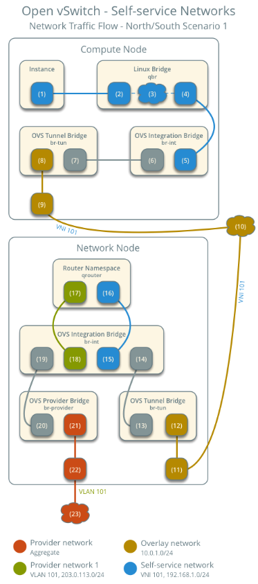  
- Instance forward packet to security group bridge thông qua veth pair (1)(2).  
- Tại (3), sẽ check các rule trong security group được áp cho instance, đồng thời tracking connection packet.  
- Tại security group bridge OVS Port forward packet tới OVS integration bridge security group port(5) thông qua veth pair.  
- OVS integration bridge add internal tag VLAN.  
- OVS int bridge đổi interal vlan tag thành internal tunnel ID.  
- OVS int bridge patch port (6) forward packet tới OVS tunnel bridge patch port (7).  
- OVS tunnel bridge (8) đóng packet VXLAN.  
- Card mạng vật lý của mạng overlay (9) forward packet tới network node thông qua mạng overlay (10).  
- Card mạng vật lý của mạng overlay (11) forward packet tới OVS Tunnel bridge (12).  
- OVS tunnel bridge mở packet và add internal tunnel ID.  
- OVS tunnel bridge đổi internal tunnel ID thành internal VLAN tag.  
- OVS tunnel bridge patch port (13) forward packets tới OVS int bridge patch port (14).  
- OVS int bridge port for self service network (15)  remove internal VLAN và forward packet tới card mạng self-service (16) của router namespace.  
- SNAT thành IP Provider của router và gửi tới gateway của mạng provider (17).  
- Router forward packet tới OVS int bridge port của provider network (18).  
- OVS int add internal VLAN tag vào packet.  
- OVS int bridge int-br-provider patch port (19) forward packet tới OVS provider bridge phy-br-provider patch port (20)  
- OVS provider bridge đổi internal VLAN tag thành VLAN thật.  
- OVS provider bridge provider network port (21) forward packet tới card mạng vật lý của network node (22).  
- Card mạng vật lý forward packet ra internet (23).  

#### North-South Floating IP
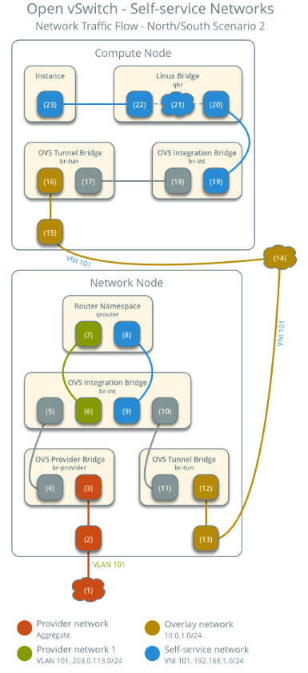  
- Quá trình khi packet từ Internet đến Floating IP ngược lại với quá trình đi ra ngoài Internet ở trên. Chú ý là khi OVS integration bridge port for provider network forward packet tới port provider network của router, lúc này Router sẽ thực hiện DNAT từ floating IP --> địa chỉ IP của instance.  

### East-West
#### Same Network
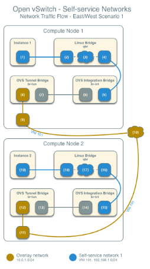  
- Instance forward packet to security group bridge thông qua veth pair (1)(2).  
- Tại (3), sẽ check các rule trong security group được áp cho instance, đồng thời tracking connection packet.  
- Tại security group bridge OVS Port forward packet tới OVS integration bridge security group port(5) thông qua veth pair.  
- OVS integration bridge add internal tag VLAN.  
- OVS int bridge đổi interal vlan tag thành internal tunnel ID.  
- OVS int bridge patch port (6) forward packet tới OVS tunnel bridge patch port (7).  
- OVS tunnel bridge (8) đóng packet VXLAN.  
- Card mạng vật lý của mạng overlay (9) forward packet tới compute node 2 thông qua mạng overlay (10).  
- Card mạng vật lý của mạng overlay (11) trên compute 2 forward packet tới OVS tunnel bridge (12).  
- OVS tunnel bridge mở packet và gán interal tunnel ID.  
- OVS tunnel bridge đổi internal tunnel ID thành internal VLAN tag.  
- OVS tunnel bridge patch-int patch port (13) forward packet tới OVS int bridge patch-tun patch port (14).  
- OVS int bridge remove internal VLAN tag.  
- OVS int bridge security group port (15) forward packet tới security group bridge ovs port (16).  
- Tại (17), sẽ check các rule trong security group được áp cho instance, đồng thời tracking connection packet.  
- Security group bridge instance port (18) forward packet tới instance 2 interface (19) thông qua veth pair.  

#### Diff Network
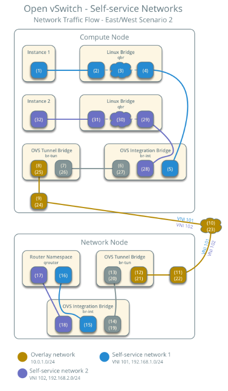  
- Instance forward packet to security group bridge thông qua veth pair (1)(2).  
- Tại (3), sẽ check các rule trong security group được áp cho instance, đồng thời tracking connection packet.  
- Tại security group bridge OVS Port forward packet tới OVS integration bridge security group port(5) thông qua veth pair.  
- OVS integration bridge add internal tag VLAN.  
- OVS int bridge đổi interal vlan tag thành internal tunnel ID.  
- OVS int bridge patch port (6) forward packet tới OVS tunnel bridge patch port (7).  
- OVS tunnel bridge (8) đóng packet VXLAN.  
- Card mạng vật lý của mạng overlay (9) forward packet tới network node thông qua mạng overlay (10).  
- Card mạng vật lý của mạng overlay (11) trên network node forward packet tới OVS tunnel bridge (12).  
- OVS tunnel bridge mở packeget và gán interal tunnel ID.  
- OVS tunnel bridge đổi internal tunnel ID thành internal VLAN tag.  
- OVS tunnel bridge patch-int patch port (13) forward packet tới OVS int bridge patch-tun patch port (14).  
- OVS int bridge port for self service network (15)  remove internal VLAN và forward packet tới card mạng self-service (16) của router namespace.  
- Router gửi packet tới next-hop IP Address, thường là IP gateway của mạng self service 2 thông qua self service network 2 interface (17).  
- Router forward packet tới OVS int bridge port for self service network 2 (18).  
- OVS int bridge add internal vlan vào packet.  
- OVS int bridge đổi internal VLAN thành internal tunnel ID.  
- OVS tunnel bridge patch-int patch port (19) forward packet tới OVS int bridge patch-tun patch port (20).  
- OVS tunnel bridge đóng gói packet bằng VXLAN của mạng self service 2.  
- Card mạng vật lý của mạng overlay (22) trên network node forward packet tới compute node thông qua mạng overlay (23).  
- Card mạng vật lý của mạng overlay (24) trên compute node forward packet tới OVS tunnel bridge (25).  
- OVS tunnel bridge mở packet và gán interal tunnel ID.  
- OVS tunnel bridge đổi internal tunnel ID thành internal VLAN tag.  
- OVS tunnel bridge patch-int patch port (26) forward packet tới OVS int bridge patch-tun patch port (27).  
- OVS int bridge remove internal VLAN tag.  
- OVS int bridge security group port (28) forward packet tới security group bridge ovs port (29).  
- Tại (30), sẽ check các rule trong security group được áp cho instance, đồng thời tracking connection packet.  
- Security group bridge instance port (31) forward packet tới instance 2 interface (32) thông qua veth pair.  